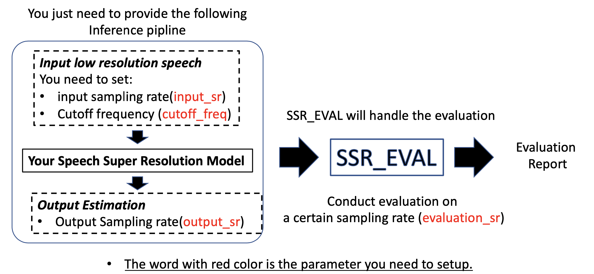

# SSR_EVAL
What this repo do:
- A toolbox for speech super resolution evaluation.
- Benchmarking new speech super resolution methods (pull request is welcome!). 



## Installation  
Install via pip:
```shell
pip3 install ssr_eval
```
Please make sure you have already installed [sox](http://sox.sourceforge.net/sox.html).

## Quick Example
examples/test.py: 
```python
from ssr_eval import SR_Eval, BasicTestee

# The class that you need to implement
class MyTestee(BasicTestee):
    def __init__(self) -> None:
        super().__init__()
    
    def infer(self, x):
        """A testee that do nothing

        Args:
            x (np.array): [sample,], with model_input_sr sample rate
            target (np.array): [sample,], with model_output_sr sample rate

        Returns:
            np.array: [sample,]
        """
        return x
    
testee = MyTestee()
handler = SR_Eval(testee, 
                    test_name="unprocess", 
                    input_sr=44100,
                    output_sr=44100,
                    evaluation_sr=48000,
                    setting_fft = {
                        "cutoff_freq": [24000],
                    }, 
)
handler.evaluate()
```
The code will automatically handle the dataset downloading.

## Baselines

Table.1 Performance of different methods on each input sampling-rate (Evaluated on 44.1kHz). 

|  Method | One for all | Params| 2kHz | 4kHz | 8kHz | 12kHz | 16kHz | 24kHz | 32kHz |  AVG |
|:--------------------:|:----:|:----:|:----:|:----:|:----:|:-----:|:-----:|:-----:|:-----:|:----:|
| [NVSR](https://github.com/haoheliu/ssr_eval/tree/main/examples/NVSR) | Yes | 99.0M | 1.04 | 0.98 | 0.91 |  0.85 |  0.79 |  0.70 |  0.60 | 0.84 |
| NuWave(24kHz→48kHz) | No | 3.0M | - | - | - |  - |  - |  0.70 |  - | 0.70 |
|      Unprocessed      | - |  - | 5.69 | 5.50 | 5.15 |  4.85 |  4.54 |  3.84 |  2.95 | 4.65 |

> Click the link of the model for more details.

> Here "one for all" means model can process flexible input sampling rate.

## Features

## Dataset Details
The evaluation set is the VCTK Multi-Speaker benchmark.

